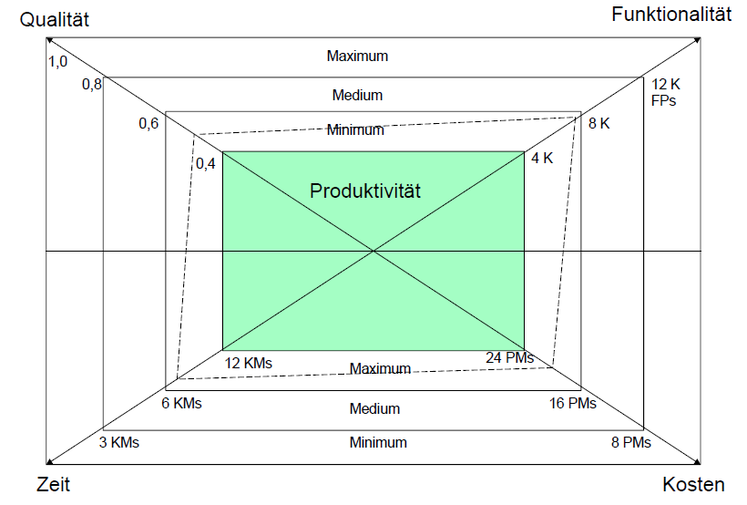
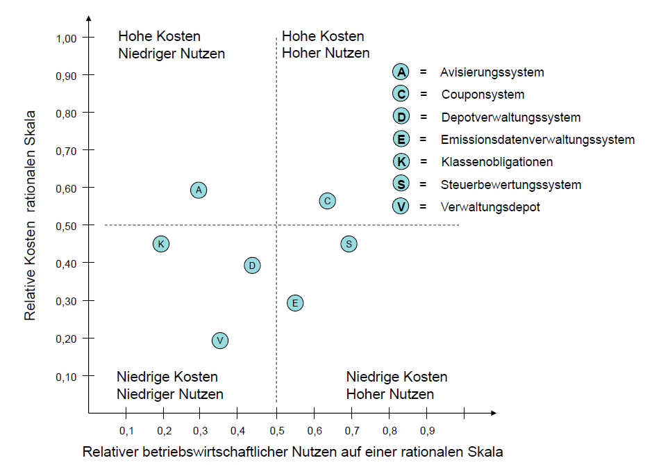

# Kalkulation
Um ein Projekt überhaupt zustande zu bekommen benötigt man Mittel, die man von einem Manager bekommen muss. Jedoch möchte der Manager eine Aufwandsabschätzung zum Projekt haben. Der Projektleiter kann jedoch, ohne mit dem IT-Projekt angefangen zu haben, nicht abschätzten welchen Aufwand es benötigt und ohne Mittel vom Manager kann das Projekt nicht starten. Also was nun? Der Projektleiter ist gezwungen seine Aufwandsabschätzung zu erraten und muss auf dieser „ausgedachten“ Basis das Projekt managen. Direkt am Anfang des Projekts findet schon eine Widersprüchliche Ausgangsbedingung statt.
Um ein Projekt richtig anzugehen muss man es kalkulieren. Hier für hilft das Teufelsquadrat von Sneed.

Der Projektleiter versucht mit den 4 Variablen (Qualität, Funktionalität, Zeit und Kosten) sein Projekt zu planen. Die Produktivität des Teams ist für ein bestimmten Zeitpunkt fix. Der Projektleiter kann jedoch nur zwei Variablen steuern, weil sich dadurch die anderen beiden mit verändern.  Entweder mit Kosten und Zeit, was die Rückwärtsplanung wäre, oder mit der Qualität und Funktionalität, was die Vorwärtsplanung wäre. Die Kunst dahinter ist es die Grenzen zu untersuchen.
Um die Produktivität herauszufinden empfiehlt es sich eine Produktivätsstudie durchzuführen, sie vermisst Größe, Komplexität und Qualität des Systems. Die Produktivität wird durch folgende Formel ausgerechnet: Produktivität = Quantität (z.B Funktion-Points) x Qualität(Qualitätsfaktor) / Aufwand ( Personentage). Durch eine Source-Code-Analyse kann man Function-Points, Data-Points und Object-Points ableiten. Der Qualitätsfaktor ist eine Zahl zwischen 1 – 0, diese wird mit dem Wert 0,5 dividiert. Diese Produktivität wird jährlich erneuert, um immer auf den neusten Stand zu sein.
Wie geht man mit Projektrisiken um? Als erstes sollte man diese Kategorisieren; Technologierisiken, Applikationsrisiken, Personalrisiken, Performanzrisiken, Qualtitätsrisiken, und betriebliche Risiken. Danach wird das Risiko bewertet mit der Formel: Risikowahrscheinlichkeit =  Gewichtung von Risiken (zwischen 0,1 – 2,0) x Expertenmeinung (0,1 – 1).
Danach wird die Risikoaussetzung mit dieser Formel ausgerechnet: Risikoaussetzung = Maximum von allen Risikoaussetzungsrechnungen ( Max_Verlust x Risikostufe). 
Anschließend berechnet man den Risikoaussetzungsfaktor aus: Risikoaussetzungsfaktor =  Risikoaussetzung / Gesamtkosten des Projekts.
Fortlaufend werden die Gegenmaßnahmen des Risikos mit einem Erfolgswahrscheinlichkeitsfaktor  
Bewertet und anschließend wird ein Risikominderungsfaktor mit der Formel berechnet: Risikominderungsfaktor = (Summe Erfolgswahrscheinlichkeitsfaktor) / (Anzahl Erfolgswahrscheinlichkeitsfaktor).
Zum Schluss wird der Endgültige Risikofaktor mit der Formel berechnet: Risikofaktor = (Risikowahrscheinlichkeit x Risikoaussetzung) x ( 1- Risikominderungsfaktor + 1.
Durch so eine Kalkulation kann man früh erkennen, wie teuer ein Projekt werden kann.

Außerdem ist der Nutzwert ein wichtiger Faktor, ob ein Projekt gestartet werden soll. Dafür gibt es zwei Formel, die für die Berechnung des Nutzwertes vorliegen. Als erstes : Nutzwert = erwartender Umsatz – geplanten Betriebskosten, oder: Nutzwert =  geplante Betriebskosten – (Kostenersparnis wenn man das neue System benutzt). 
Durch Erfahrungen kann man sagen das Alte Systeme ein höheren Nutzwert haben als neuere Systeme, aber wen man ein neues System einführt, sollte man es langsam einführen, weil bei einem zu schnellen einführen können weitere Kosten und/ oder Probleme auftauchen.

Durch die Value-Driven Methode werden Projekte selektiert und gesteuert. Dafür wird der Nutzwert und der Risikofaktor als Bewertungsfaktor genommen. Es wird das Return on Investment untersucht, was mit einer Formel errechnet wird: Return on Investment = Nutzwert / (Kosten * Risikofaktor).
Das Ergebnis sollte mindestens 1 ergeben, um genehmigt zu werden. 

Um eine Produkt – und Projektwirtschaftlichkeit zu berechnen sind gewisse Rahmenbedingungen erforderlich. Messbarkeit des Produktnutzens, Kalkulierbarkeit der Projektkosten, Erkennbarkeit der Projektrisiken und Vorhersehbarkeit der Produktfolgekosten.

Wie auf der Abbildung zu erkennen ist, sortiert man die einzelnen Projekte/Produkte nach ihrem Nutzungswert und Kosten. Die Projekte, die sich im oberen rechten Teil befinden müssen überprüft werden ob der Nutzen die hohen Kosten rechtfertigen. Die Projekte im oberen linken Teil werden gestrichen, weil sie hohe Kosten aber ein niedriges Nutzen haben. Die Projekte im unteren linken Teil werden in der Regel auch gestrichen, weil die Projekte an sich nicht gebraucht werden. Hauptsächlich suchen wir die Projekte, die im unteren rechten Teil sind. Das sind die Projekte, die ein hohen Nutzwert aber kaum Kosten haben.
