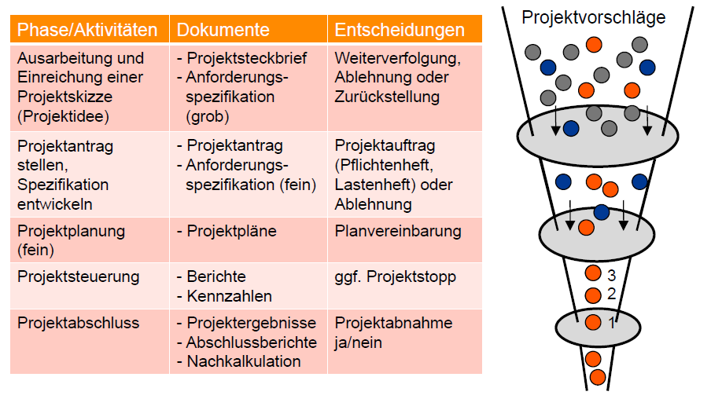

# Multiprojektmanagement
 
Um mehrere Projekte gleichzeitig zu managen braucht man gewissen Instrumente, es hat sich dafür das IT-Projektportfolio bewährt. Man benötigt dafür;  eine geschlossene IT-Organisation, starke Abhängigkeiten zwischen den verschiedenen IT-Projekten, Projekte verfolgen komplementäre oder konkurrierende Ziele und starke Synergien zwischen den IT-Projekten.
Bei den Teilbereichen im IT-Multiprojektmanagement wird deutlich, dass eingehende Anträge zur Durchführung eines IT-Projekts für Entscheidungszwecke einer Analyse zu unterziehen sind, aufgrund der Analyseergebnisse eine Planung und ggf. Anpassung des gewünschten IT-Portfolis notwendig ist, es ratsam ist, die It-Protfolios mit den Stakeholdern zu kommunizieren, eine fortlaufende Verfolgung und Steuerung der verschiedenen Projekte des Portfolios vorgenommen werden sollte und ggf. auch Anpassungsmaßnahmen notwendig sind.

Merkmale des Multiprojektmanagement helfen einem die Herausforderung zu verdeutlichen. 
Die wären; IT-Projekte weisen unterschiedliche Komplexitäten auf, Projekte greifen auf gleiche Ressourcen zu, Projekte haben miteinander Abhängigkeiten, Einzelprojekte werden nach anerkannten Regelungen und Vorgehensweisen zum Projektmanagement abgewickelt.
Falls man mehrere Projekte gleichzeitig führt sollte, man auf gewisse Problembereiche gefasst sein. Zum einem sollte man sich Gedanken machen, welche Bedeutung ein Projekt im Vergleich zu den anderen hat. Des weiterem wie viel Budget es verbraucht und wie viel Mitarbeiter man zuordnen sollte. Zu dem muss man drauf achten, das Änderungen umgangen werden sollten, die auf andere Projekte Auswirkungen haben. Zum Schluss empfiehlt es sich Doppelarbeit zu vermeiden und Synergieeffekte für alle IT-Projekte zu nutzten.
Multiprojektmanagement haben auch Vorteile. Ein Vorteil wäre, dass IT-Strategien der Unternehmungen bestmöglich umgesetzt werden. Fortführend werden alle Projekte abgestimmt und erhalten eine übergeordnete Gesamtplanung, die z.B Redundanzen und Synergien zwischen mehreren Projekten erkennen. Des weiteren werden Risiken frühzeitig erkannt, bewertet und Maßnahmen ergriffen. Weiterreichend kann man die gesamte Projektlandschaft zielorientiert im Sinne der Gesamtorganisation steuern. Außerdem lassen sich Abgabetermine durch zentrale Stellen optimal koordinieren. Ein weiterer Vorteil ist das Projekte kosten – und termintreu abgewickelt werden können. Und als letzter Punkt sind durch die vielen Projekte schon eine gewisse organisatorische Infrastruktur vorhanden, oder werden aufgebaut.
Es werden nie alle Projekte durchgeführt, die vorgeschlagen werden. In der folgenden Abbildung, erkennt man durch welche Kriterien man sich Entscheiden sollte um ein Projekt durchzuführen.

Im Projektportfolio werden drei verschiedene Projekttypen Priorisiert: Muss-Projekte (unausweisliche Projekte),  Soll-Projekte (Von Unternehmungsleitung gesetzt) und Standard-IT-Projekte (erhobenen oder von Fachbereichen artikulierten Anforderungen eine Modernisierung der IT-Solution).
Projekte können weiter klassifiziert werden anhand ihrer Strategieorientierung: Entweder durch operativen Bedarf, erforderlich um andere IT-System aufrechtzuerhalten und zu betreiben oder durch Strategische Initiativen und Weiterentwicklung eines Unternehmens im Hinblick seiner Marktleistungsfähigkeit.
Für eine klare Bewertung und akzeptierte Priorisierung der genehmigten Projekte, werden Entscheidungstechniken benutzt. Es gibt die Rangfolgeverfahren im Team, das bedeutet ein Entscheidungsteam bewertet die Projekte in einer Rangfolge im Hinblick auf die Notwendigkeit/Wünschbarkeit. Des weiteren gibt es die ABC-Technik, hier werden Projektideen/eingereichte Projekte nach A-, B- oder C-Projekte eingestuft. A-Projekte haben eine hohe Priorität und C-Projekte eine sehr niedrige. Dazu kommt die Nutzerwertanalyse, welches den Nutzwert (siehe Kalkulation) berechnet und danach sortiert wird. Die letzte Entscheidungstechnik ist die Portfoliotechnik mit der man Projekte nach Projektrelevanz und Wirtschaftlichkeit (ROI, siehe Kalkulation) oder Projektaktivität und Projektrisiko (siehe Kalkulation) bewertet und einordnet.

Um ein Multiprojektmanagement planen zu können müssen im Vorfeld paar Fragestellungen geklärt werden. Zu einem wie verteilt man das Budget auf die Projekte ein, wie verteilt man Ressourcen und wie organisiert man die Aufgaben.
Verschiedene Handlungsfelder erleichtern eine optimale Planung für Multiprojekte. Das erste Handlungsfeld ist die Zuordnung von personalen Ressourcen, das zweite Handlungsfeld ist der Ressourceneinsatz, das dritte Handlungsfeld ist die Budgetverteilung und das letzte Handlungsfeld ist die Planoptimierung.
Projekte können auch zeitlich verknüpft sein, deswegen sollte man darauf immer achten. Es könnte zum Beispiel sein das Projekt B abhängig von Projekt A ist. Diese Planung nennt man die Zeitplanung. 
Zu dem kommt noch die Ressourcen- und Kapazitätsplanung, die sich mit der Aufgabe beschäftigt Ressourcen zeitlich zu planen, also das Ressourcen zum richtigen Zeitpunkt am richtigen Ort sind.

Es empfiehlt sich ein Multiprojektcontrolling zu benutzten. Diese hat die Aufgabe den Programm- und Projektablaufplanung zu beachten, im Hinblick der Kapazitätsgegebenheiten, der Kosten- und Finanzwirkung und mögliche Nebenbedingungen.
Das Kernziel ist es innerhalb der gewünschten Zeit die gewünschten Ergebnisse der Projekte zu erzielen.

Das Überwachen von IT-Projektportfolios ist sehr wichtig. Deswegen müssen Reports zielgenau geschehen. Daten müssen empfängergerecht aufbereitet werden, die Daten müssen aktuell wie möglich sein, in einer Form dargestellt werden, die die jeweilige Situation widerspiegelt.

Es gibt drei große Verwaltungsstrukturen für die Organisatorische Gestaltung des Multiprojektmanagements. Die erste Struktur ist der Projektlenkungsausschuss. Sie wird gebildet durch die Leiter der Fachbereiche, sie legen monatlich Analysen über Projekte vor und steuern Risiken.
Die zweite Struktur ist das Projektbüro. Diese administriert alle Projekte einer Organisation. Sie hat die Aufgabe, die zentrale Ansprechstelle für die Planung zu sein, alle Projektstatusinformationen einzuholen, Vorbereitung und Dokumentation der mit IT-Leitern abzuhaltenden Sitzungen, Weiterleitung von Entscheidungsgrundlagen an den Lenkungsausschuss, periodische Überarbeitung der Projektrahmenplanung und formale Kontrolle von Projektaufträgen und Projektabschlussberichten.
Die letzte Struktur ist die Zentrale Projektverwaltung. Es gibt drei Möglichkeiten wie man diese organisatorisch umsetzt. Die erste Möglichkeit ist es eine Zentrale (physische) Projektablage einzurichten. Die zweite ist eine Vernetzung der Planungs- und Dokumentationssysteme der einzelne IT-Projekte einzurichten. Die letzte Möglochkeit ist eine zentrale Projektdatenbank zu etablieren.

