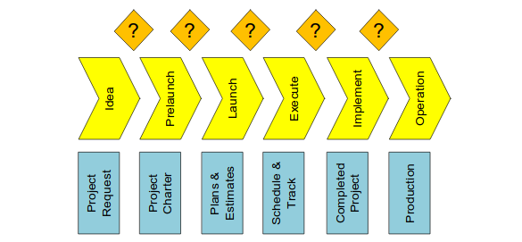
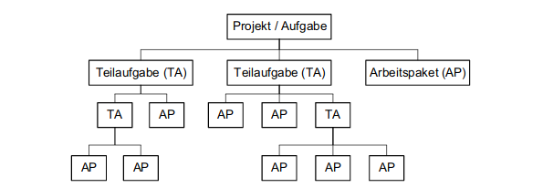
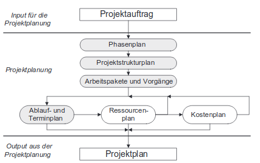

# IT-Projekte strukturieren und planen
 
 Zum Start eines jedes IT-Projekts ist es wichtig, dass alle Teilnehmer Wissen was zu tun ist,
deshalb gibt es die Projektplanung.
Man plant um einen so genannten "Projektfahrpläne" zu erstellen. In diesem Fahrplan
werden Fragen beantwortet wie etwa: Wie lange wird es dauern, bis wir über diverse
Zwischenstationen das Produkt erreicht haben? Da man vorher nie zu 100% voraussagen
kann wie der beste Ablauf eines Projektes ist, ist eine Planung nie einfach und vermutlich
auch nie richtig. Jedoch ist es auch nicht das Ziel eines Projektplans richtig zu sein. Er sollte
möglichst richtig sein damit die Teilnehmer sich dort dran orientieren können. Wichtig bei
einem solchen Projektplan das Ziele und Anforderungen erfasst werde, dabei ist zu bedenken
das die Planung Voraussetzung und Grundlage für die Projektumsetzung und
Projektkontrolle ist.
Ein erhöhter Planungsaufwand in den frühen Phasen eines Projekts kann den gesamten
Projektverlauf positiv beeinflussen. Es ist also sinnvoll sich mit entsprechender Intensität
und Qualität der Planung zu widmen, da so die Projektlaufzeit verkürzt und die
Produktlebensdauer evtl. sogar erhöht wird. Zudem ist die Planung zu kontrollieren, um
frühe Fehler zu erkennen.

Aus der Praxis lässt sich festhalten, dass wenn ein Projekt mit Aufwand geplant wurde, lässt
eine drastische Zeiteinsparung in der Abarbeitung des Projekts finden.
Grundsätzliches zur Projektplanung
Damit die Planung eines Projektes nicht planlos erfolgt, gibt es Grundsätze an denen sich orientiert
werden kann.
Als erstes ordnet man den Ablauf, d.h. welche Aufgaben wann, wie und evtl. warum erledigt
werden. Dieser Prozess besteht aus einer gedanklichen Simulation des Ablaufs des gesamten
Projekts. Als Ergebnis erhalten wir einen "roten Faden" an dem sich die Teilnehmer
orientieren können. Zur Hilfe kann man sich folgende Fragen stellen: Kann das so
geschehen? Fehlen irgendwelche Teile? , eignen sich die ausgedachte Reihenfolge?.
Des Weiteren ist es Wichtig einen "Rahmen" zu schaffen. Hier werden Dinge festgelegt wie:
welche Tätigkeiten erledigt werden müssen, durch wen diese Tätigkeiten erledigt werden
müssen, wann diese erledigt werden müssen, mit welchen Ressourcen diese erlegt werden
müssen und zu welchen Kosten diese Dinge erledigt werden müssen.
Nach der Grundsätzlichen Planung ist jedoch festzuhalten, dass immer wieder
Fragestellungen oder Unsicherheit aufkommen können. Um auf diese Umstände vorbereitet
zu sein bietet es sich an den Projektplan nicht zu stark zu fixieren, um auf eventuelle
ungeplante Ereignisse reagieren zu können. Da man in solchen Fällen den Projektplan
anpassen muss, kann man sagen das die Projektplanung ein dynamischer Prozess ist. ImAllgemeinen gilt je komplexer eine Projekt ist, desto größer ist die Wahrscheinlichkeit das
man sein Projekt später anpassen muss.
In der Praxis ist eine Projektplanung fester Bestandteil eines Projekts, weshalb dies auch
entlohnt werden will. Da aber in der Realität meist keine Zeit dafür ist und der Auftraggeber
Ergebnisse sehen will, ist man gezwungen die Projektplanung schlicht und kurz zu halten.
Aus diesem Grund entstand auch der Satz Zitat: " Ordnung kostet Geld, aber Unordnung
noch viel mehr!" von Heinrich Gerber.
Um ein Projekt richtig zu strukturieren ist es wichtig sich mit seinem gewünschten Produkt
vertraut zu machen. Da sich die Planung eins Projekts immer nach dem Produkt richtet kann
man um sein Produkt einzuordnen sich am Produktlebenszyklus orientieren.
Damit die Struktur eines Projekts richtig gegliedert wird bietet es sich an das Projekt in
verschiedene Phasen einzuteilen. Dabei kann es grobe Oberphasen geben die kleinere
Unterphasen enthalten. Dieses phasenorientierte Vorgehen bietet mehrere Vorteile: die
Komplexität wird verringert, das Projekt wird überschaubarer, die Transparenz wird erhöht
und Erfolgserlebnisse werden sichtbar, da man sehen kann wenn kleinere Phasen
abgeschlossen sind.
Durch diese Projekt Einteilung entstehen zwei verschiedene Blickwinkel. Es gibt die
Einteilung der eigentlichen Projektarbeit, um stufenweise die Sachergebnisse zu erarbeiten
und die Einteilung der Aktivitäten, die den Problemlösungsprozess organisieren und
begleiten. Die erste Einteilung beschäftigt sich also mit der Projektinhalt. Diese
Projekteinteilung kann man in verschiedenen Arten modellieren, daraus entstehen dann auch
die verschiedenen Phasenmodelle wie das Wasserfallmodell oder das V-Modell. Die zweite
Einteilung beschäftigt sich mit dem Projektmanagement. Unabhängig vom Projektinhalt
fallen bei jedem Projekt nahezu identische Aufgaben im Projektmanagement an.

Dabei befassen sich die einzelnen mit Stages (gelb) mit verschiedenen Fragen:
- Idee = ist die Idee brauchbar
- Prae-Launch = Sollen wir oder sollen wir nicht?
- Launch = Wie werden wir das Projekt abwickeln?
- Execute = Wie bringen wir das geplante Projekt zum Laufen bzw. wie halten wir es am
Laufen?
- Implantation= Wie bringen wir die Projektergebnisse in die operative Phase?
Jedoch ist bei diesem Modell anzumerken, das in der Praxis Schwierigkeiten bei der
Abgrenzung dieser Phasen auftreten können. Allgemein lässt sich sagen das bei Benutzung
dieses Modells auf hohe Flexibilität zu achten ist.
Bei jedem Projekt muss die Projektleitung als erstes die Frage beantworten welches
Phasenmodell benutzt werden soll. Da dies immer vom zu erzielenden Produkt abhängt ist
diese Frage nicht immer leicht zu beantworten. Um an diese Frage welches Modell benutzt
werden soll heranzugehen bieten sich drei Wege. Als erstes ist es möglich die Antwort aus
der Literatur herauszulesen. Es gibt eine ganze Menge an "typischen" Modellen, die sich inverschiedenen Branchen etabliert haben. Als zweites kann es Vorgaben vom Unternehmen
oder Auftraggeber geben, die ein bestimmtes Modell verlangen. Wenn einen die beiden
zuerst genannten Methoden nicht weiterbringen gibt es noch den gesunden
Menschenverstand, der einen dabei hilft sein Projekt richtig zu modellieren. In der Praxis
wird die erste Methode mit der Dritten vermischt, so entsteht ein Plan mit Struktur und
erfüllbaren Zielen. Ein Beispiel eines solchen Plans ist das Modell für
Entwicklungsvorhaben nach Saynisch.

Für die Planung eines konkreten IT-Projekts bei dem nicht auf eines der "klassischen"
Modelle zurückgegriffen werden soll, gilt es sich an folgenden Punkten zu orientieren, um
ein für sich geeignetes Modell zu entwickeln. Jede zu erstellender Phase braucht einen
Namen, eine Kurzbeschreibung, eine Voraussetzung, ein Ergebnis und ein
Abschlussmeilenstein. Durch diese Definierung erhält der Projektablauf seine ersten eigenen
Konturen. Somit wird eine Grundlage für das Projekt geschaffen.
Nachdem also die Frage der Phaseneinteilung geklärt ist kann man sich dem Projekt-
Struktur-Plan widmen. Dieser Projekt-Struktur-Plan liefert eine Übersicht über alle nötigen
Arbeiten, dient als Grundlage für Risikoanalysen, erleichtert die erste Budgetierung, ist ein
zentrales Dokument für die Projektsteuerung, hilft dabei die Projektorganisation
bedarfsgerecht weiterzuentwickeln und beschreibt was und nicht wie es zu tun ist. Um einen
Struktur plan zu realisieren sollte sich an drei Punkten orientiert werden. Zunächst einmal
sollte zu Beginn der Projektverlauf Strukturiert werden, man teilt die Aufgaben entweder
nach top-down oder nach dem bottom-up Prinzip auf. Beim top-down Prinzip werden
mehrere Ebenen erstellt und diese vom Ganzen (oben) nach Details (unten) gegliedert. Das
bottom-up Prinzip sammelt zuerst alle wichtigen Aufgaben. Anschließend werden sie
selektiert, geordnet und in unter Oberpunkten zusammengefasst.
Nachdem die Struktur festgelegt ist bildet man Arbeitspakete. Hierbei wird lediglich
bestimmt welche Aufgaben zusammengehören und wo sie sich abgrenzen. Eine Darstellung
des Projekt-Struktur-Plans kann in einem Baum erfolgen.

Als dritten Planungsschritt werden Ablauf und Termine berücksichtigt. Da der Projekt-
Struktur-Plan keine Zeitlichen Vorgaben aufweist werden diese nun erfasst. Es wird ein
Ablaufplan erstellt, welcher die Fragen beantwortet: Welche Arbeitstakte können
unabhängig voneinander durchgeführt werden?, Welche Arbeitstakte sind unmittelbare
Voraussetzung für andere Arbeitstakte?, Welche Arbeitstakte können unmittelbar folgen?,
Welche Aktivitäten lassen sich parallel ausführen?. Die entstehende Ausarbeitung kann man
in einem Netzplan darstellen.

Da die Aufgaben teilweise schwierig zu bewerten sind, gibt es eine Aufwandsabschätzung.
Anhand der entstandenen Schätzungen kann dann überprüft werden ob Termine realistisch
sind. Des Weiteren können Meilensteine erstellt werden, die es gilt einzuhalten. Die Zeitliche
Gestaltung lässt sich in einem Diagramm darstellen.

Ein weiteres Thema des Planens von Projekten ist das Puffermanagement. Es ist eins der
heikelsten Themen und wird häufig aus Zeitmangel ignoriert. Dazu kommt das es schwer ist
Pufferzeit zu verkaufen, da kein Auftraggeber hören will das er Zeit zu bezahlen hat die als
Puffer genutzt wird. Um also mögliche Zeitliche Schwierigkeiten vorzubeugen hat man die
zum einen die Möglichkeit von Anfang an mehr Zeit einzuplanen oder sich eben eine
Pufferzeit mit einzuteilen. Diese einzuplanende Pufferzeit hängt natürlich vom Umfang des
Projektes ab. Aus verschiedenen Erfahrungen in der Praxis sagt man das die Pufferzeit eine
Größenordnung von etwa 30% erreicht.
Die bisherige Projektplanung wird hier einmal grafisch dargestellt.

Der Ablauf- und Terminplan, Ressourcenplan und der Kostenplan sind Pläne die man nicht
zu 100% vorhersagen kann da hier die meisten Variablen auftreten. Im Ressourcenplan
werden wie erwartet alle benötigen Ressourcen, die für die Realisierung des Projekts
erforderlich sind aufgeführt. Hier werden Arbeitsmittel wie Computer, Material und Räume
sowie aber auch das benötigte Personal aufgeführt. Bei dieser Planung ist stehts darauf zu
achten das die geforderten Ressourcen auch realistisch im Sinne der Kosten sind.
(Bild Checkliste Ressourcenanforderung S.34 IT.planung asdasdasd)
Die größte Variable im Ressourcenplan ist der Mensch selbst. Bei einem Computer kann
man davon ausgeben das alle dieselbe Leistung haben. Beim Menschen ist es anders, hier ist
darauf zu achten das die Menschen nicht überfordert werden. Darum muss diese Planung
sehr gewissenhaft ausgeführt werden.
Neben dem Ressourcenplan ist der Kostenplan ein weiterer Faktor für eine erfolgreiche
Projektplanung. Hier werden alle Kosten des Projekts aufgeführt. Um den Kostenplan zu
erstellen kann man Schrittweise vorgehen. Zunächst kann man die Arbeitspakete aus dem
vorher erstellten Projekt-Struktur-Plan herausziehen. Sieht man sich das Arbeitspaket und
das darin enthaltene Personal an, kann man daraus eine Kostenschätzung erstellen. So geht
man die einzelnen Arbeitspakete durch und enthält am Ende einen Kostenplan/Budget. Bei
der Kostenschätzung ist darauf zu achten welches Personal, Sachmittel und externe
Dienstleistung in Anspruch genommen werden. Es ist darauf zu achten das von Zeit zu Zeit
der Kostenplan kontrolliert wird, um mögliche Fehleinschätzungen zu erkennen.
Je komplexer das IT-Projekt ist desto mehr unbekannte Faktoren gibt es. Dementsprechend
ist die Erstellung einer Risikoanalyse sinnvoll. Dabei kann man nach einem einfachen
Schema vorgehen. Beim Projektauftrag werden zunächst die möglichen Risken identifiziert.
Nachdem man alle Risiken identifiziert hat werden diese Risiken bewertet. Hat man die
Risiken bewertet kann man dafür Maßnahmen oder Notfallpläne entwerfen.

Bei der Planung eines IT-Projektes gibt es aus der Praxis einen einfachen Tipp: KISS (keep it
simple, stupid). Wenn man seine Planung einfach hält kann das mehrere Vorteile bieten.
Zum einen vereinfacht eine einfachere Planung, dass Verständnis für den gesamten Plan. Des
Weiteren ist dieser leichter anpassbar. Jedoch erfordern größere Projekte eine komplexere
Planung.
