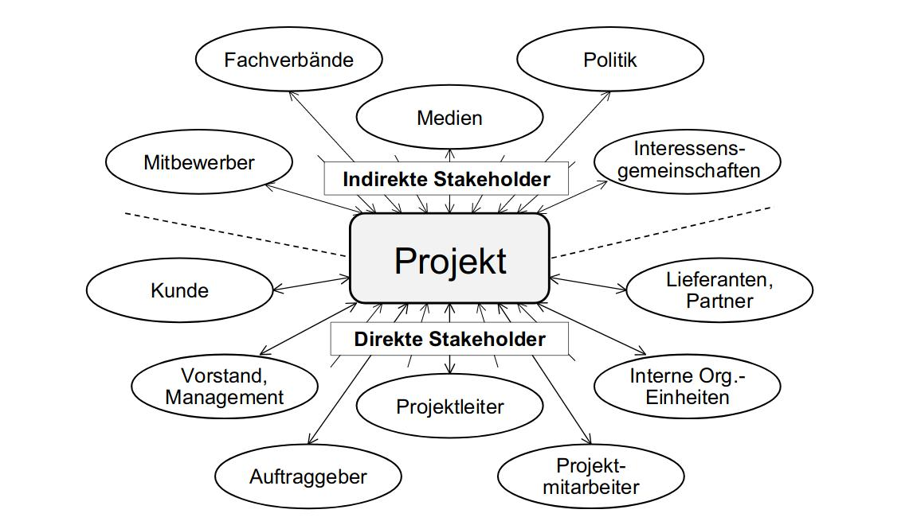
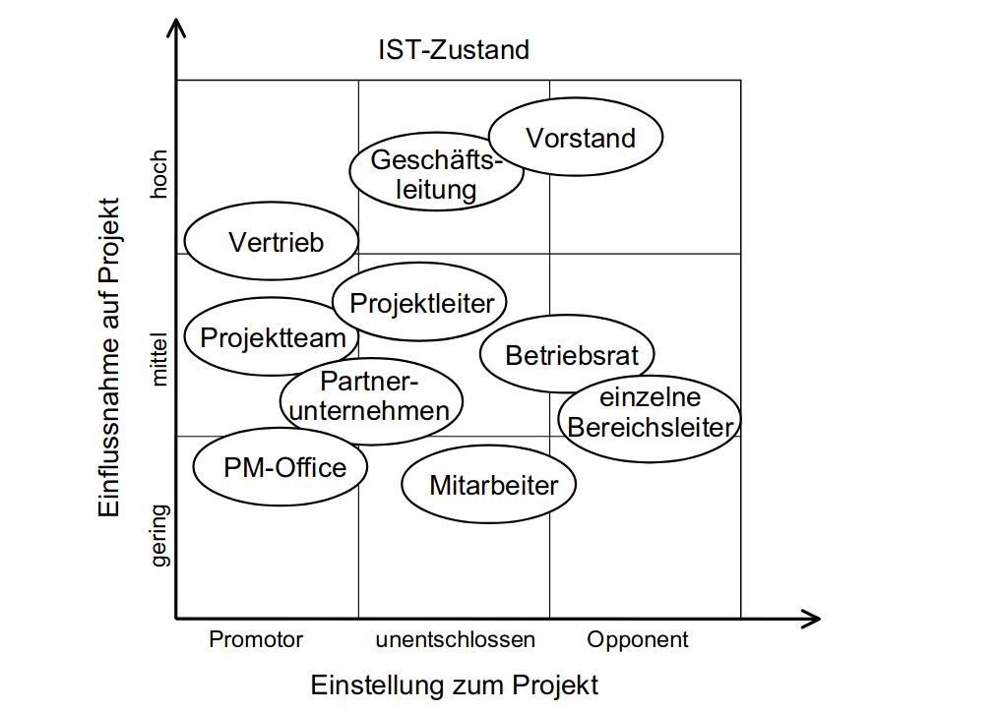

# Stakeholder-Management

IT-Projekte haben das Ziel, neue Produkte zu schaffen. Allerdings hat eine Firma nichts davon, ein neues Produkt fertigzustellen, wenn sich kein Abnehmer dafür finden lässt. Früher lag der Fokus im IT-Projektmanagement eher auf der Gestaltung von Produkten und einer guten Projektabwicklung. Inzwischen liegt die Herausforderung allerdings darin, ein Produkt richtig zu vermarkten und sich von anderen Produkten abzuheben. Ein Begriff, der in diesem Zusammenhang häufig genannt wird, ist „Akzeptanz“. Das Ziel von IT-Projektmarketing ist es, dass ein Produkt bzw. ein Projekt von den Stakeholdern akzeptiert wird.

### Definition
An dieser Stelle sollte zunächst einmal der Begriff „Stakeholder“ erläutert werden. Als Stakeholder bezeichnet man die Personen, die an dem Ergebnis eines Projekts oder an dem Projektverlauf selbst Interesse haben. Man unterscheidet zwischen unternehmensinternen und -externen Stakeholdern. Zu den unternehmensinternen Stakeholdern zählen z.B. die Geschäftsleitung und das Projektteam. Zu den unternehmensexternen gehören z.B. die Kunden und die Anwender des Endprodukts.
Des Weiteren unterscheidet man zwischen direkten und indirekten Stakeholdern. Direkte Stakeholder sind diejenigen, die in unmittelbarem Kontakt mit dem Projekt stehen, wie z.B. die Geschäftsleitung und der Auftraggeber. Alle Stakeholder, die nicht in unmittelbarem Kontakt mit dem Projekt stehen, nennt man indirekte Stakeholder. Hierzu gehören z.B. Mitbewerber und Medien.

 
(Stakeholder-Management für IT-Projekte Abbildung 18.1)

### Stakeholder-Analyse
Um herauszufinden, welche Stakeholder bei einem Projekt existieren und wie die einzelnen Stakeholder zum Projekt bzw. zum Produkt stehen, ist es möglich, eine sogenannte Stakeholder-Analyse durchzuführen, in welcher man sich intensiv mit den verschiedenen Positionen Kunde, Projektteam, Management und der Öffentlichkeit auseinandersetzt. Im Idealfall gehen aus dieser Bedrohungen und Chancen für das Projekt hervor. Es gibt verschiedene relevante Faktoren, in denen sich die Stakeholder untereinander unterscheiden können. Zum einen ist da die Grundeinstellung zum Projekt. Diese kann sowohl positiv als auch negativ sein, aber auch alles dazwischen. An dieser Stelle lassen sich die Stakeholder in vier Gruppen einteilen. Die „Promotoren und Sponsoren“ stehen hinter einem Projekt und unterstützen dieses aktiv. Die „Supporter“ stehen zwar ebenfalls hinter dem Projekt, unterstützen dieses aber nur passiv. Das Gegenteil dieser beiden Gruppen sind die „Opponenten“, welche Projektgegner sind. Bei diesen besteht das Risiko, dass sie das Projekt zum Scheitern bringen. In der Mitte befinden sich die „Hopper“, welche kein eigenes bzw. kein festes Meinungsbild aufweisen. 
Des Weiteren haben verschiedene Stakeholder unterschiedlich viel Macht bzw. Einfluss auf ein Projekt. Auch hier ist von hoch bis gering alles möglich. Außerdem offenbart eine Stakeholder-Analyse die Interessen der Stakeholder. Wenn diese mit den Interessen des Projekts verglichen werden, zeigt sich wie hoch das Konfliktpotenzial ist. Stimmen die Interessen weitestgehend überein, ist das Konfliktpotenzial niedrig. Wenn allerdings das Gegenteil der Fall ist, ist das Konfliktpotenzial dementsprechend hoch. Nicht nur die Interessen, sondern auch die Erwartungen und Befürchtungen der Stakeholder können variieren. Eine Stakeholder-Analyse zeigt, welche Erwartungen die Stakeholder an das Ergebnis des Projekts, aber auch an den Projektverlauf haben. 
Es ist ebenfalls wichtig, sich vor Augen zu führen, welche Beziehungen die Stakeholder untereinander aufweisen. Hier gilt es herauszufinden, an welchen Stellen Allianzen, Abhängigkeiten und Konflikte existieren. Hierbei ist es unter Umständen vor allem bei größeren Projekten ratsam, ein sogenanntes „Stakeholder-Portfolio“ anzufertigen, in welchem man die jeweiligen Einstellungen der Stakeholder zueinander und deren Einflussstärke grafisch darstellt, um eine bessere Übersicht zu erlangen. 

 
(Stakeholder-Management für IT-Projekte Abbildung 18.2 S.616)

### Weiteres Vorgehen
Es ist allerdings auch möglich, abseits der Analyse anhand verschiedener Verhaltensmuster herauszufinden, dass ein Stakeholder eine negative Einstellung zum Projekt hat. Es gibt verschiedene Verhaltensmuster, welche auf Widerstand hindeuten können. Hierzu gehören u.a. ein geringes Engagement im Projekt und ausweichende und unklare Antworten auf klar formulierte Fragen. 
Es gibt verschiedene Wege, mit solch einem Widerstand umzugehen. Diese können in drei Möglichkeiten aufgeteilt werden. Die erste Möglichkeit ist das „partizipative Vorgehen“. Hierbei bindet man den Stakeholder, so weit es möglich ist, in Entscheidungsprozesse mit ein, wodurch ein partnerschaftliches Verhältnis entstehen soll. Die zweite Möglichkeit ist das „diskursive Vorgehen“, wobei man mit dem Stakeholder über mögliche Lösungen diskutiert und somit Konflikte löst. Die dritte Möglich ist das „repressive Vorgehen“, bei der man den Stakeholder einfach vor vollendete Tatsachen stellt und diesen nur auf Anfrage Informationen zukommen lässt, welches gewissermaßen ein Ausnutzen der eigenen Macht bedeutet. 
Es ist wichtig, schon so früh wie möglich mit dem Stakeholder-Management zu beginnen. Außerdem sollte Stakeholder-Management während des gesamten Projekts stattfinden. Hierfür eignet sich eine iterative Durchführung verschiedener Aufgaben. Zunächst sollte man eine Stakeholder-Analyse durchführen, um diese zu identifizieren. Als nächstes sollten Maßnahmen geplant werden, worauf das Ausführen dieser Maßnahmen folgt. Als letztes sollten die Wirkungen dieser überprüft werden.
Das Stakeholder-Management hat verschiedene Auswirkungen auf verschiedene Bereiche des Projekts. Auf die Projektplanung wirkt sich das Stakeholder-Management insofern aus, dass sich durch die aus der Analyse abgeleiteten Maßnahmen einzelne Arbeitspakete bilden. Durch das Stakeholder-Management werden im Risikomanagement Risiken im Zusammenhang mit Stakeholdern erkannt und im Projektmarketing entsteht eine werbende Wirkung durch Promotoren. 
